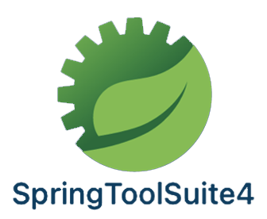

  

# Princiais Design Patterns Java 

<h4 align="center"> 
	 Status: Under development.
</h4>

 

**Record of notes, classes and applications made and learned throughout the course.**

---

  <a href="#about">About</a> •
  <a href="#programmatic-content">Programmatic content</a> •
  <!--<a href="#preview">Preview</a> • -->
  <a href="#tech-stack-and-tools">Tech Stack and tools</a> <!-- •
  <a href="#publication">Publication</a> •
  <a href="#author">Author</a>--> 

---

## About
 

> Knowing and understanding the main design patterns used in Java with [AlgaWorks](https://github.com/algaworks), [Normandes Junior](https://github.com/normandesjr) (course instructor), tutors, as well as other students.
 

- Learning is also the reason for using Portuguese and the many comments in the code.

## Programmatic content

- Introduction
- Factory Method
	
	- Challenge: Factory Method 
	
- Builder

## Tech Stack and tools

 
    
    
    
    
    

